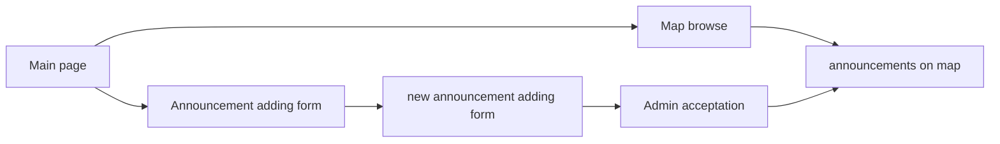

# Welcome to Mega-Ads

This app is frontend part of Mega-Ads  which is announcement open street map based portal. Application was made like a one of final projects of MegaKurs.

## About app

This simply Application gives possibility for user to add announcement on map. It is possible to attach link to full announcement in another site, price, and short description. System checking that added URL is correct and exist  After admin approve it will be visible for other user. Administrator can confirm new announcement by clicking on activation link sent to his email box. Map is based on open street map.

Application is very simple:

## Technologies

Application was made with React written in TypeScript.

Map is based on open street map.  Override was used to make common (back-end and front-end) base of types files.

## How to start ?

After cloning this repository use node package manager to add required packages.  Tap on your console:

- npm install

After that you can start developer server:

- npm start

Or make static production version:

-npm run build

## Contact

To reach the author use email address: pileckidariusz90@gmail.com

## Copyrights

All code in this repository is free to use